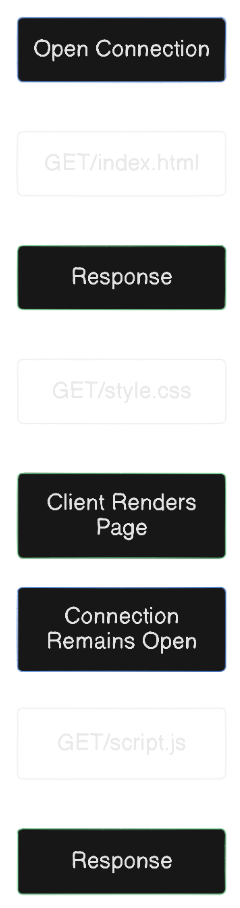
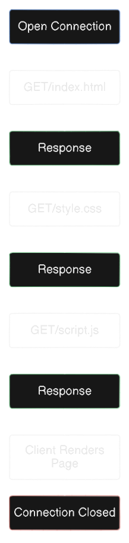

# HTTP Crash Course & Exploration - [Traversy Media](https://youtu.be/iYM2zFP3Zn0?si=gPTQ0c0NpaXFYw3N)

### 
What is HTTP
- Hyper Text Transfer Protocol
- Communication between web servers & clients
- HTTP Requests / Responses
- Loading pages, form submission, Ajax calls 
### HTTP is stateless
- Every request is completely independent
- Similar to transactions
- Programming, Local Storage, Cookies, and Sessions are used to create an enhanced user experience 
### What is HTTPS?
-  Hyper Text Transfer Protocol Secure
- The data sent is encrypted
- SSL(Secure Socket Layer)/TLS(Trasport Security Layer)
- Install the certificate on a web host 
### HTTP methods
- **GET** - Retrieves data from the server
- **POST** - Submit data to the server
- **PUT** - Update data already on the server
- **DELETE** - Deletes data from the server 
### HTTP Header Fields
- **General:** Request URL, Request Method, Status code, Remote Address, Referrer Policy
- **Response:** Server, Set-cookie, content-type, content-length, date
- **Request:** Cookies, Accept-xxx, content-type, content-length, Authorization, User-Agent, Referrer 
### HTTP status codes
- **1xx:** Informational - Request received/processing
- **2xx:** Success - Successfully Received, Understood and accepted
- **3xx:** Redirect - Further action must be taken/redirect
- **4xx:** Client Error - Request does not have what it needs
- **5xx:** Server Error - Server fails to fulfil a valid request

| Status Code | Response |
| ----- | ----- |
| `200` | `OK` |
| `202` | `OK created` |
| `301` | `Moved to a new URL` |
| `304` | `Nor Modified (Cached Version)` |
| `400` | `Bad Request` |
| `401` | `Unauthorized` |
| `404` | `Not Found` |
| `500` | `Internal Server Error` |

### HTTP/2
- Major revision of HTTP
- Under the hood changes
- Respond with more data
- Reduce latency by enabling full Request and Response Multiplexing
- Fast, Efficient & Secure

### .
| http/1.1 Baseline| http/2 Multiplexing |
| ----- | ----- |
|  |  |
